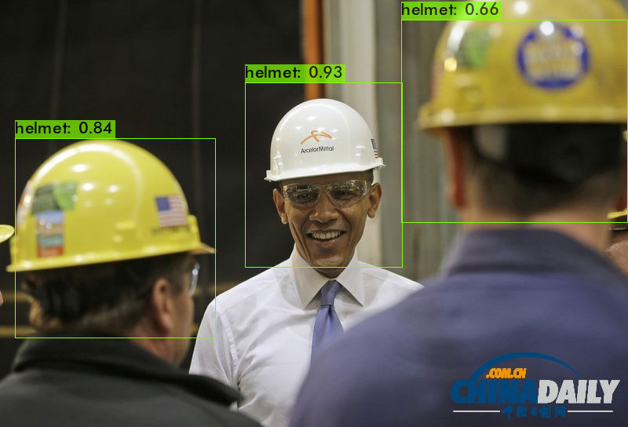
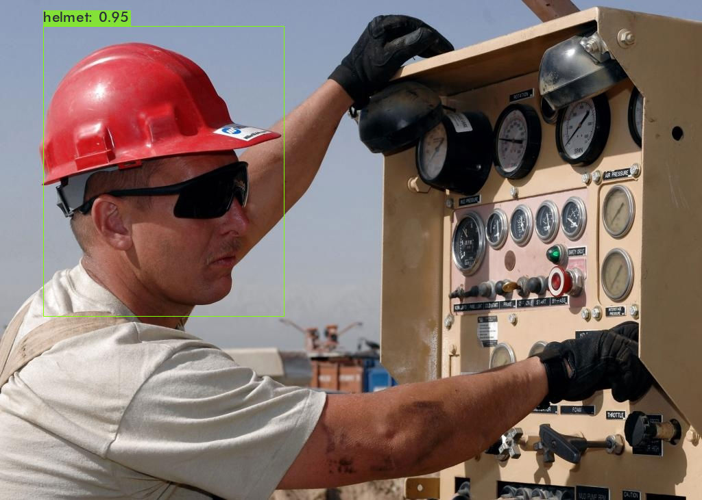

# object_detection

# Data set
Data set is downloaded from https://www.kaggle.com/vodan37/yolo-helmethead 

# Google colab notebooks
yolo v3-https://colab.research.google.com/drive/1U3fYJkdETHIBuXHK4JYbBwb4Ogm-MWQ6?usp=sharing

yolo v4-https://colab.research.google.com/drive/1pGcu73udbxcYlfyMWvaazG8x0qDHH5rL?usp=sharing

# Medium Blog
part 1-https://karthikeyatirumalasetty.medium.com/yolo-v3-v4-custom-object-detection-on-colab-part-1-43f35f3a7508

part 2-https://karthikeyatirumalasetty.medium.com/yolo-v3-v4-custom-object-detection-on-colab-part-2-b0aac2df3628

# Results
## yolo v3
```
detections_count = 100815, unique_truth_count = 19964  

class_id = 0, name = head, ap = 68.07%   	 (TP = 9920, FP = 5332) 

class_id = 1, name = helmet, ap = 82.18%   	 (TP = 4921, FP = 449) 


 for conf_thresh = 0.25, precision = 0.72, recall = 0.74, F1-score = 0.73 

 for conf_thresh = 0.25, TP = 14841, FP = 5781, FN = 5123, average IoU = 51.55 % 


 IoU threshold = 50 %, used Area-Under-Curve for each unique Recall 
 mean average precision (mAP@0.50) = 0.751253, or 75.13 % 
Total Detection Time: 68 Seconds
```

## yolo v4
```
 detections_count = 66813, unique_truth_count = 19964  

class_id = 0, name = head, ap = 91.83%   	 (TP = 11896, FP = 1796) 

class_id = 1, name = helmet, ap = 89.13%   	 (TP = 5509, FP = 626) 

 for conf_thresh = 0.25, precision = 0.88, recall = 0.87, F1-score = 0.87 

 for conf_thresh = 0.25, TP = 17405, FP = 2422, FN = 2559, average IoU = 66.54 % 

 IoU threshold = 50 %, used Area-Under-Curve for each unique Recall 
 mean average precision (mAP@0.50) = 0.904795, or 90.48 % 
Total Detection Time: 83 Seconds
```
# Predictions

### yolo v3


### yolo v4


### yolo v3

### yolo v4


### Comparing Results


video link https://www.youtube.com/watch?v=nXm2iX0s-8I

